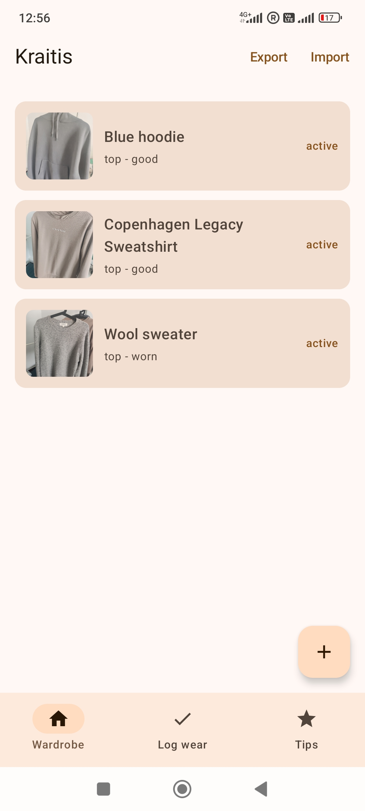
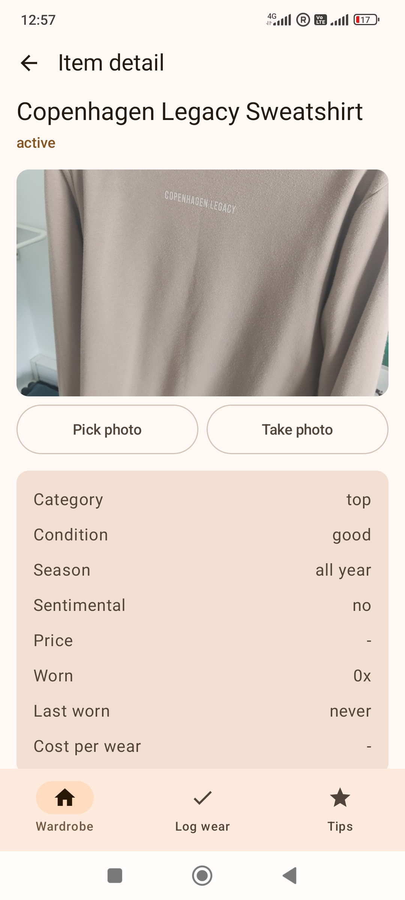
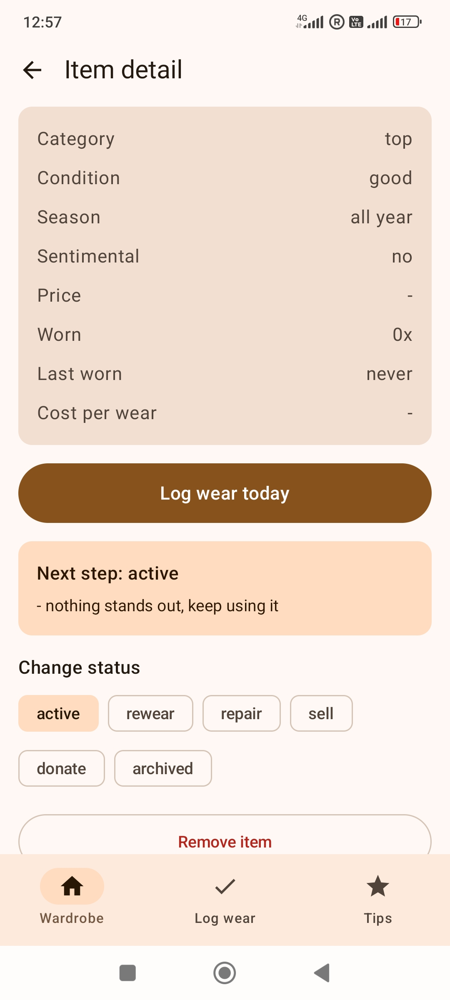
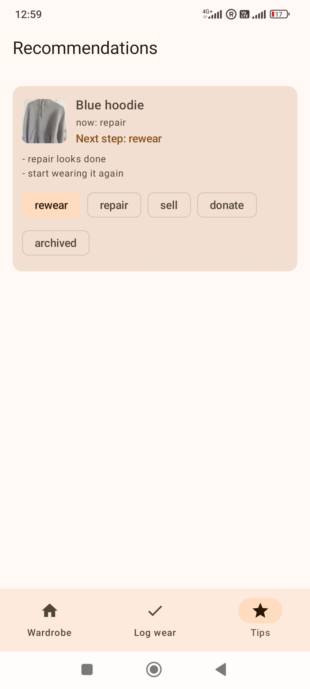

# Kraitis

Kraitis *(Lithuanian for trosseau, wardrobe)* is a local-first Android app for wardrobe auditing, written in Kotlin and Jetpack Compose.

## Table of Contents
- [Screenshots](#screenshots)
- [How to build](#how-to-build)
- [Features](#features)
- [Roadmap](#roadmap)
- [Reflection](#reflection)

## Screenshots

| Wardrobe | Item detail | Item status | Recommendations |
|---|---|---|---|
|  |  |  |  |

## How to build
- Open this folder in Android Studio
- Let Gradle sync (it may take a bit on first open, as usual)
- Run the app on an emulator or physical Android device
- Min SDK is 24

The app stores everything locally with Room, so right now there is no backend link.

## Features

- Wardrobe list:

  - Add clothing items with name, category, condition, season, optional price and sentimental value

  - Saved items stay after restarting the app because they are stored in a local Room database

  - Tap an item to open a small detail page

- Item photos:

  - Pick a photo from the gallery

  - Take a new photo with the camera

  - Photos are copied into app storage, so the item can still show them later

- Wear tracking:

  - Log that an item was worn today

  - See wear count, last worn date and cost per wear

  - There is also a quick "Log wear" tab because opening every item one by one gets annoying quickly

- Recommendations:

  - The app suggests what to do next with clothes that need attention

  - Recommendations include short reasons, so it is not just a random status label

  - You can mark the item as rewear, repair, sell, donate or archived

- Local backup:

  - Export wardrobe data as JSON

  - Import a JSON backup back into the app

- Reminder notification:

  - A daily WorkManager reminder can show a short summary if some clothes are waiting for action

## Roadmap

(or things I may add/fix next, in no very serious order)

- [ ] Better editing for existing clothing items

- [ ] Delete items properly from the UI

- [ ] More careful import handling, especially around photo paths

- [ ] A small repair notes field, maybe

- [ ] Nicer empty states

- [ ] Unit tests for the decision engine and backup parsing

- [ ] Some UI tests

- [ ] App icon polish, to switch over from the default icon

## Reflection
This is a learning project, so the goal was not to make the biggest possible app. I wanted something small that actually works and has a clear point.

I made it in the span of about 5 days, so some parts are definitely still a bit rough around the edges.

For most of the code I tried not using LLMs, however I resorted to them for reminding myself how a few Compose APIs are usually wired, and getting suggestions when a function was becoming too messy. I still tried to keep the final code simple enough that I understood what was going on.

I like that the recommendation part is straightforward. It doesn't try to use AI image recognition for fashion taste or look up the market price of clothes, and relies just on simple signals.

However, there is still room for improvement. I should add UI and Unit tests, customize it more to not look like a default android app, and improve item editing.
